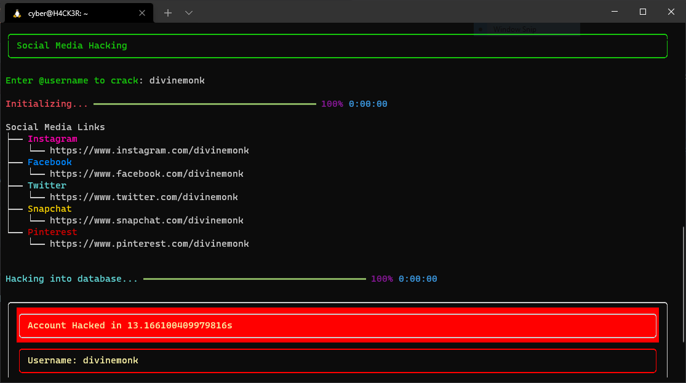

```
░░█ █░█ █▀ ▀█▀   █░█ █░█ █▀▀ █▄▀ ▄█ █▄░█ █▀▀
█▄█ █▄█ ▄█ ░█░   █▀█ ▀▀█ █▄▄ █░█ ░█ █░▀█ █▄█
```

<a href=''></a>
<a href=''></a>
<a href='https://www.python.org/'></a>


 

> for more images, click me [🔴](images/more.md)


<br>
<br>
<br>


# __*pip*__ installation

IF you don't have '[pip](https://www.google.com/search?q=install+pip)' or '[python3](https://www.google.com/search?q=install+python+3)' installed - install them !

### Install *justinghacking* with simple command :
```
pip install justhacking
```
<br>

Command works for (& in) *Windows - Command Prompt | Linux & Mac OS - Terminal*


<br>
<br>


# __*Git clone*__ installation

### Clone this *repository* with *git* :
```
git clone https://github.com/Divinemonk/justhacking/
```

### Then follow these commands 
```
cd justhacking
pip install -r requirements.py
pip install setup.py
```


<br>
<br>
<br>


# Usage

Open terminal or command line and type : `justhacking`

Done ! - Your fake hacking / hacking simulation setup is ready !!


